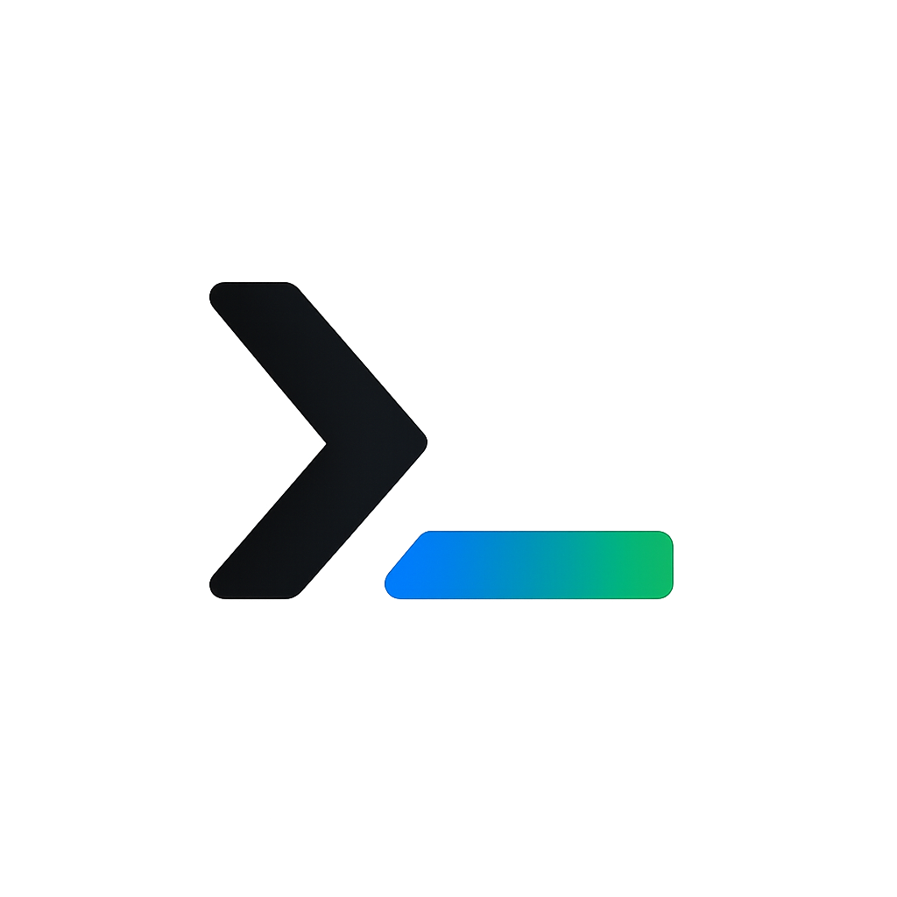

<div align="center">
  
  
  <h1 align="center">Portfolio Website</h1>
  <p align="center">
    <b>My digital playground, creative resume, and a love letter to code.</b>
  </p>
  <p align="center">
    <i>Built with React, TypeScript, Vite, and Tailwind CSS</i>
  </p>
</div>

---

## Inspiration

I wanted a portfolio that felt like <b>me</b> — not just another cookie-cutter template. I was inspired by:

- The <b>terminal aesthetic</b> (because, let's be honest, the command line is home)
- Minimal, fast, and interactive UIs
- The desire to show not just my work, but my <b>personality</b>

## Thought Process

I started with a blank canvas and a lot of caffeine. My goals:

- **Showcase my projects** in a way that's visually engaging
- Make navigation <b>keyboard-friendly</b> (because accessibility matters)
- Keep it <b>blazing fast</b> and responsive
- Let my story, skills, and journey shine through

## The Struggle

Building this wasn't all rainbows:

- Tweaking Tailwind configs for that perfect look
- Wrestling with React state and component structure
- Making sure everything works on every device (hello, mobile bugs 👋)
- Obsessing over tiny details (pixel-perfect or bust)

But every bug squashed and every late-night commit made it better.

## Tech Stack

| Tool/Library      | Why I Used It                                  |
|-------------------|-----------------------------------------------|
| React             | Component-based UI, fast, flexible            |
| TypeScript        | Type safety, better dev experience            |
| Vite              | Insanely fast dev/build tool                  |
| Tailwind CSS      | Utility-first, rapid styling                  |
| Custom Components | For everything from nav to terminal loader    |

## Project Structure

```bash
src/
  components/      # All the custom React components
  assets/          # Images, icons, etc.
  App.tsx          # Main app logic
  main.tsx         # Entry point
  ...
public/
  image.png        # Logo/hero image
  ...
```

## Features

- ⚡ Super fast load times (thanks, Vite!)
- 🎨 Custom, modern design (no boring templates)
- ⌨️ Keyboard navigation for accessibility
- 📱 Fully responsive (mobile-first)
- 🧑‍💻 Code-sample inspired UI (terminal vibes)
- 🛡️ TypeScript for safety
- 🌙 Dark mode ready (if you want it)

## How I Used Each Tech

- **React**: Broke everything into reusable, logical components (see `src/components/`)
- **TypeScript**: Strict types everywhere, so fewer runtime surprises
- **Vite**: Instant reloads, zero config headaches
- **Tailwind**: Custom utility classes for every pixel, with a few overrides in `tailwind.config.js`

## Getting Started

1. **Clone the repo:**
   ```bash
   git clone https://github.com/your-username/Portfolio_Website.git
   cd Portfolio_Website
   ```
2. **Install dependencies:**
   ```bash
   npm install
   ```
3. **Run locally:**
   ```bash
   npm run dev
   ```
4. **Build for production:**
   ```bash
   npm run build
   ```

## What I Learned

- How to wrangle Tailwind for custom designs
- The power (and pain) of strict TypeScript
- The importance of accessibility and performance
- That the best projects are the ones that feel personal

## Credits & Thanks

- [React](https://react.dev/)
- [Vite](https://vitejs.dev/)
- [Tailwind CSS](https://tailwindcss.com/)
- [TypeScript](https://www.typescriptlang.org/)
- All the open-source devs who make this possible

## 📝 License

MIT — use it, remix it, make it your own.

---

<div align="center">
  <b>Made with ❤️, caffeine, and way too many late nights.</b>
</div>
